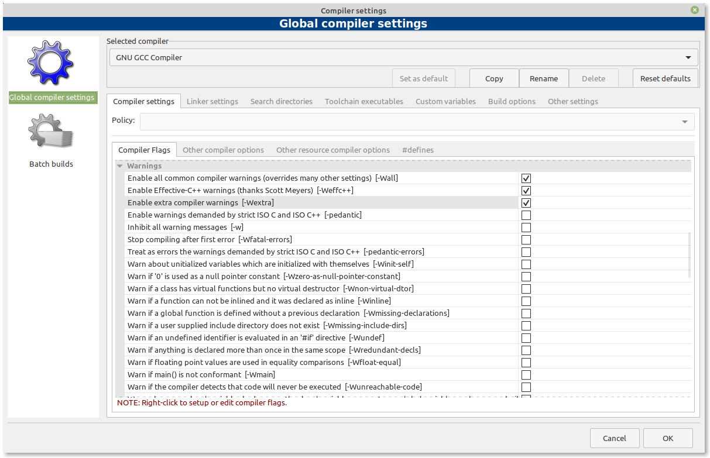
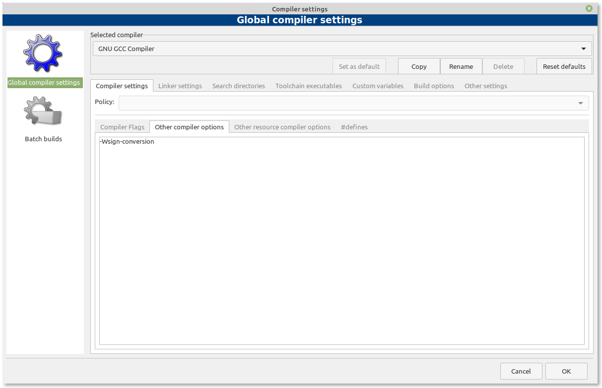

## Configurando o seu compilador via Code::Blocks: warnings

O compilador verifica se você seguiu as regras da linguagem C++. Se você fez algo que viole definitivamente as regras da linguagem, durante a compilação o compilador emitirá um erro, fornecendo tanto o número da linha que contém o erro, quanto algum texto sobre o que era esperado versus o que foi encontrado. O erro real pode estar nessa linha ou em uma linha anterior. Depois de identificar e corrigir as linhas de código erradas, você pode tentar compilar novamente.

Em outros casos, o compilador pode encontrar um código que parece estar com erro, mas ele pode não ter certeza. Nesses casos, o compilador pode optar por emitir um **warning** (ou aviso, em tradução literal). Os *warnings* não interrompem a compilação, mas são avisos ao programador de que algo parece errado.

**Boa prática de programação:** Não deixe os *warnings* se acumularem. Resolva-os à medida que os encontrar (como se fossem erros).

Por padrão, a maioria dos compiladores só gera *warnings* sobre os problemas mais óbvios. No entanto, você pode solicitar que seu compilador seja mais assertivo ao fornecer avisos para coisas que ele acha estranho. Logo abaixo, é mostrado como fazer isso.

### Configurando *warnings* via Code::Blocks

No menu, vá para a opção *Settings* > *Compiler* > aba *Compiler settings*, então encontre e marque as opções **-Wall**, **-Weffc++** e **-Wextra**, como ilustrado abaixo.

Depois, vá para a aba *Other compiler options* e adicione **-Wsign-conversion** para a área de edição de texto.

### Configurando *warnings* no compilador GCC/G++

Se você estiver compilando com o g++ via terminal, adicione as seguintes *flags* à linha de comando:  *-Wall -Weffc++ -Wextra -Wsign-conversion*

---

## Escolhendo uma versão do compilador

Até o momento, a linguagem C++ possui seis revisões de padronização da linguagem:

| Ano    | Nome Formal |  Nome Informal |
| ---    | ---         | ---            |
| 1998   | c++98       |                |
| 2003   | c++03       |                |
| 2011   | c++11       |  c++1x         |
| 2014   | c++14       |  c++1y         |
| 2017   | c++07       |  c++1z         |
| 2020   |             |  c++2a         |