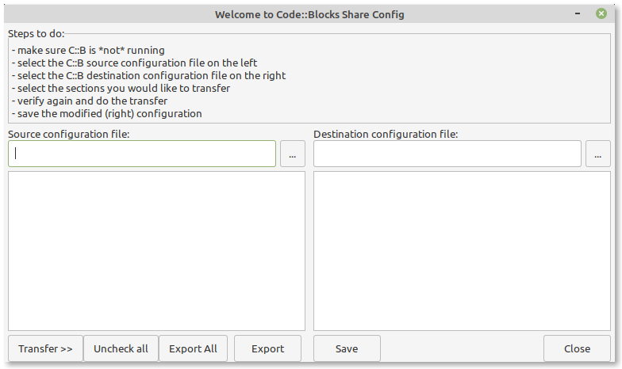
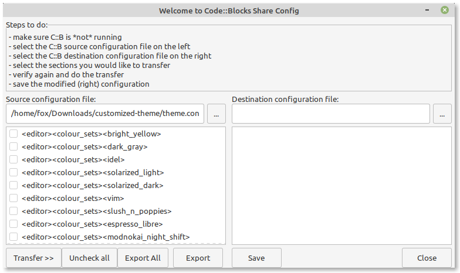
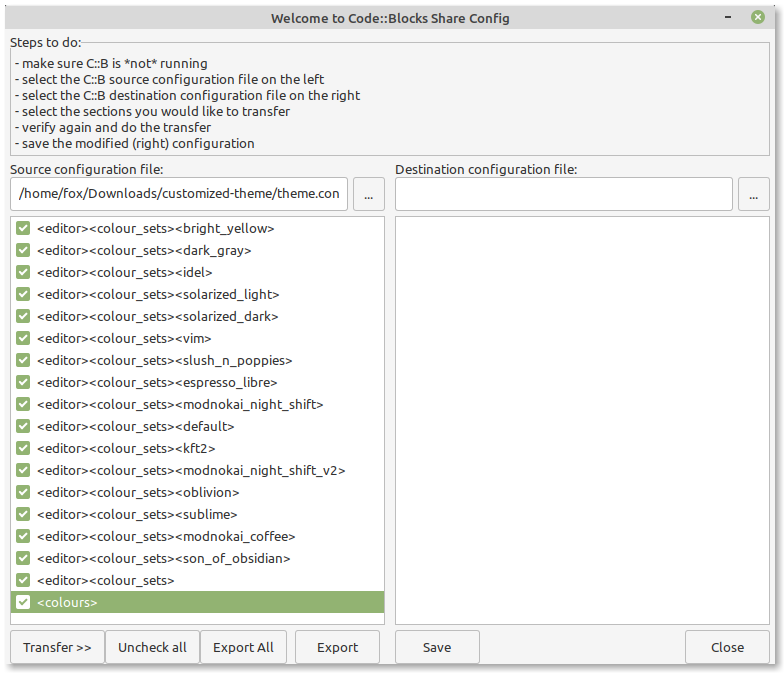
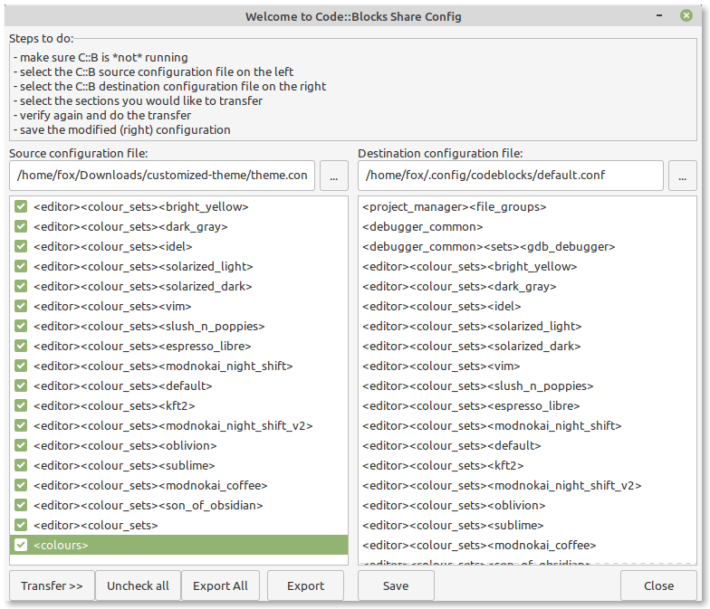

## Instalando o IDE Code::Blocks

Alguns vídeo-tutoriais de instalação do Code::Blocks:

[Vídeo: Instalação do Code::Blocks em Windows](https://youtu.be/2P_D1kn7_Q0)

[Vídeo: Instalação do Code::Blocks em Linux](https://youtu.be/z8nshkHY2Cs?t=519)

[Link para o manual do Code::Blocks (em inglês)](https://www.codeblocks.org/docs/manual_codeblocks_en.pdf)

## Instalando Dark Themes no Code::Blocks

Code::Blocks vem com um tema branco por padrão e nem todos os usuários gostam. Além disso, não há opção para alterar o tema do editor pelo próprio Code::Blocks, mas podemos alterá-lo manualmente. Logo abaixo, descrevo como instalar temas adicionais no Code::Blocks.

### Temas disponíveis para o Code::Blocks

- Son of Obsidian
- Sublime
- Oblivion
- Vim
- Dark gray
- KFT2
- Bright yellow
- Espresso Libre
- Modnokai Coffee
- Modnokai Night Shift
- Modnokai night Shift v2
- Slush and Poppies
- Solarized Dark
- Solarized Light

### Como instalar os temas no Code::Blocks?

Primeiro você precisa baixar os temas, baixe aqui: [Code::Blocks Theme](https://drive.google.com/open?id=1qj6UpKXokr_QHLrRalMrTcMjsed8vKcI). Em seguida, extraia-o na Área de Trabalho, você vai ver que foi extraído o arquivo **theme.conf**, ele contém os temas que queremos instalar. Antes de continuar adiante, certifique-se de que a aplicação Code::Blocks esteja fechada. Agora, abra o programa **CB Share Config**. `CB Share Config` é uma ferramenta que é instalada juntamente com o CodeBlocks. A seguir, explico como usar essa ferramenta no Windows e no Linux.

#### Windows

Para quem usa o sistema operacional Windows, execute o programa **cb_share_config.exe**. Ele deve estar na pasta onde você instalou o Code::Blocks. Uma imagem dele é mostrada abaixo.

Siga os seguintes passos:

- Abra o programa **CB Share Config**

- Navegue para a opção **Source Configuration file**, que está no lado esquerdo, e selecione o arquivo **theme.conf** que você baixou anteriormente. Logo abaixo, mostro uma tela de como o programa estaria nesta etapa:

- Selecione os temas que deseja importar para o Code::Blocks clicando nas caixas de seleção à esquerda. **Recomendação**: Marque todas as caixas de seleção. Logo abaixo, mostro uma tela de como o programa estaria nesta etapa:

- Navegue para a opção **Destination Configuration file**, que está no lado direito, e selecione o arquivo **default.conf**. Logo abaixo, mostro uma tela de como o programa estaria nesta etapa:

- Clique no botão `Transfer>>`, depois no botão `Save` e, finalmente, no botão `Close`. Pronto, instalação finalizada.