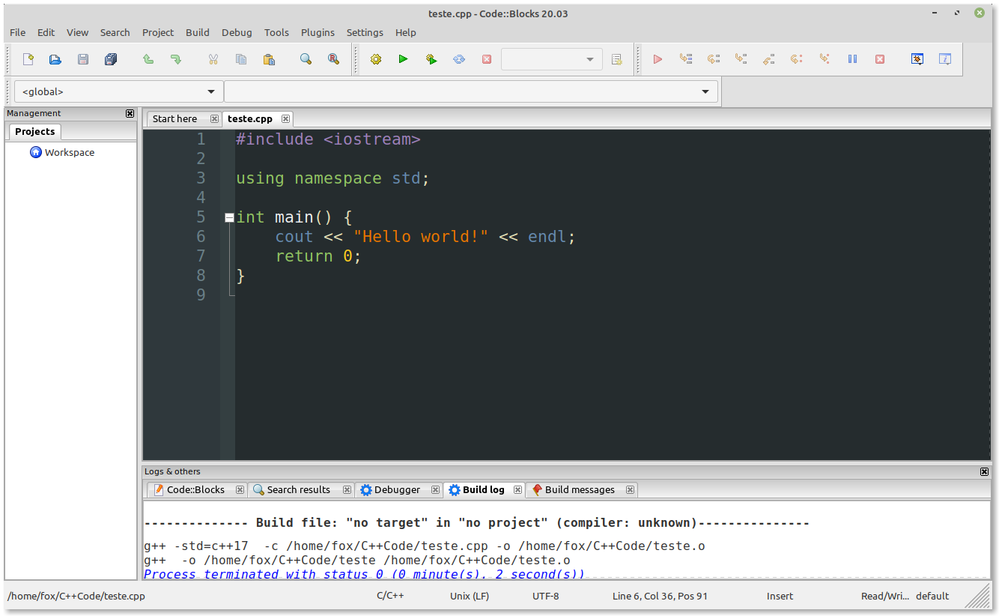

## Instalando o IDE Code::Blocks

Alguns vídeo-tutoriais de instalação do Code::Blocks:

[Vídeo: Instalação do Code::Blocks em Windows](https://youtu.be/2P_D1kn7_Q0)

[Vídeo: Instalação do Code::Blocks em Linux](https://youtu.be/z8nshkHY2Cs?t=519)

[Link para o manual do Code::Blocks (em inglês)](https://www.codeblocks.org/docs/manual_codeblocks_en.pdf)

## Customizando o Code::Blocks

### Instalando Dark Themes no Code::Blocks

Code::Blocks vem com um tema branco por padrão e nem todos os usuários gostam. Além disso, não há opção para alterar o tema do editor pelo próprio Code::Blocks, mas podemos alterá-lo manualmente. Logo abaixo, descrevo como instalar temas adicionais no Code::Blocks.