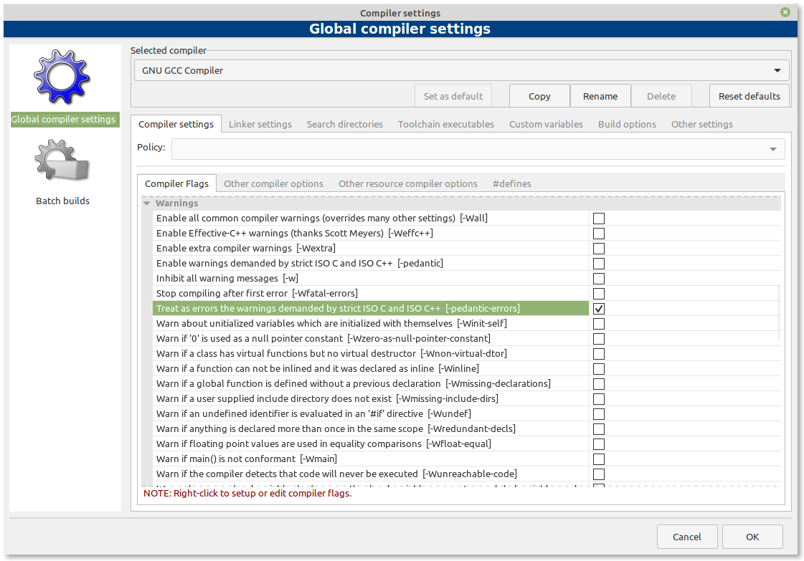

## Configurando o seu compilador via Code::Blocks: extensões do compilador

O C++ padrão define regras sobre como os programas devem se comportar em circunstâncias específicas. E na maioria dos casos, os compiladores seguirão essas regras. No entanto, muitos compiladores implementam suas próprias alterações na linguagem. Esses comportamentos específicos do compilador são chamados de **extensões do compilador**.

Ao escrever um programa que usa uma extensão de compilador, você muito provavelmente está escrevendo um programa que é incompatível com o C++ padrão. Programas que usam extensões não padrão geralmente não serão compilados em outros compiladores (que não suportam essas mesmas extensões) ou, se o fizerem, podem não ser executados corretamente.

Uma característica ruim é que extensões do compilador geralmente são habilitadas por padrão. Isso é particularmente prejudicial para novos alunos, que podem pensar que algum comportamento que funciona é parte do C++ oficial, quando na verdade seu compilador é simplesmente permissivo.

Portanto, uma boa prática de programação consiste em desativar as extensões do compilador para garantir que seus programas permaneçam em conformidade com os padrões C++ e funcionem em qualquer sistema.

### Desabilitando extensões do compilador no Code::Blocks

Desabilite as extensões do compilador através da opção de menu *Settings* > *Compiler* > aba *Compiler flags*, então encontre e marque a opção **-pedantic-errors** como mostrado na tela abaixo.

### Desabilitando extensões do compilador GCC/G++

Se você estiver compilando com o g++ via terminal, você pode desabilitar as extensões deste compilador adicionando a flag *-pedantic-errors* na linha de comando.

### Um lembrete final

As configurações acima não ficam gravadas para projetos futuros. Você precisa configurá-las toda vez que criar um novo projeto. Uma alternativa é criar um projeto-modelo com essas configurações uma vez e usá-las para criar novos projetos.

